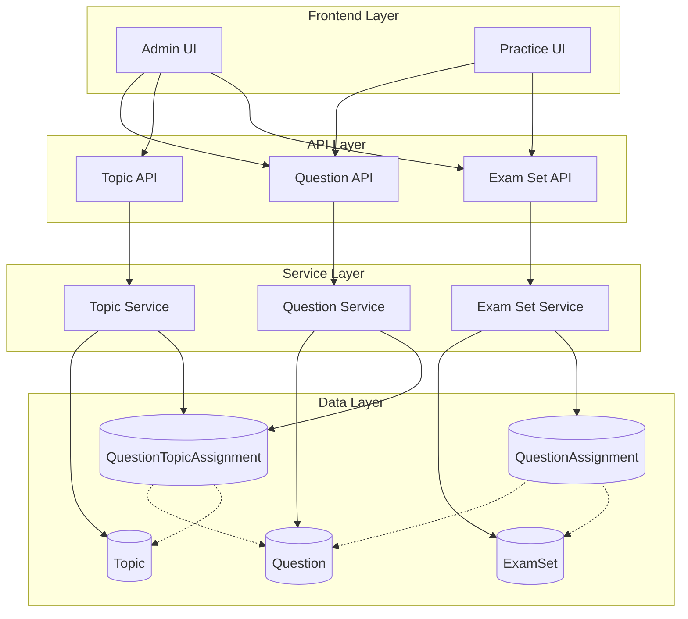
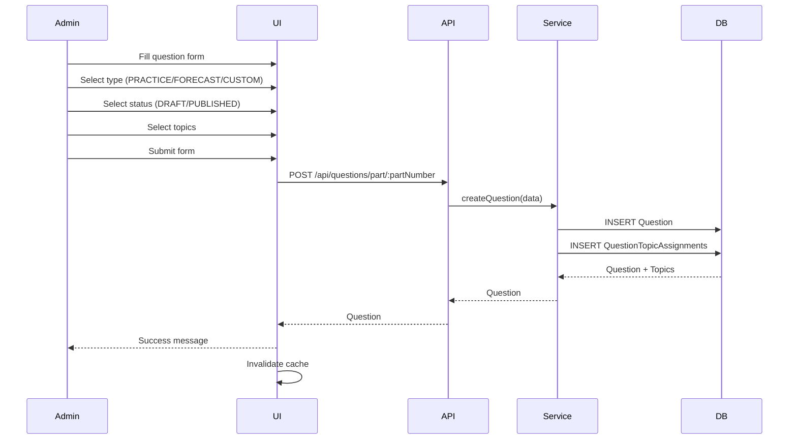
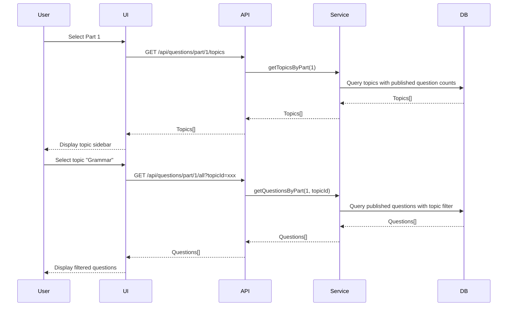
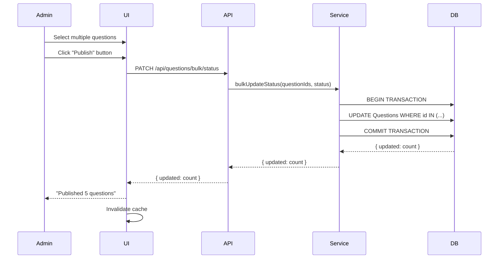

# Design Document: Question Topic System

## Overview

### Purpose

This design implements a flexible question management system that allows questions to exist independently of exam sets while maintaining backward compatibility with the existing exam set structure. The system introduces topic-based categorization, question type classification, and status management to enable more granular control over question visibility and organization.

### Key Features

- **Independent Question Management**: Questions can be created and published without belonging to an exam set
- **Topic-Based Organization**: Many-to-many relationship between questions and topics for flexible categorization
- **Question Type Classification**: PRACTICE, FORECAST, and CUSTOM types for different question purposes
- **Status Management**: DRAFT, PUBLISHED, and ARCHIVED states control question visibility
- **Backward Compatibility**: Existing exam set functionality remains fully operational
- **Enhanced Practice Interface**: Users can filter questions by part, topic, or exam set

### Design Goals

1. Enable immediate publication of individual FORECAST and PRACTICE questions
2. Provide flexible topic-based categorization for questions
3. Maintain complete backward compatibility with exam sets
4. Support efficient filtering and search in both admin and user interfaces
5. Ensure data integrity through proper validation and constraints

## Architecture

### System Components



### Technology Stack

- **Backend**: Node.js with Express.js
- **Database**: PostgreSQL with Prisma ORM
- **Frontend**: React with TypeScript
- **State Management**: TanStack Query (React Query) for server state
- **UI Framework**: Ant Design
- **API Pattern**: RESTful API with JSON responses

### Migration Strategy

The system will use a **hard reset approach** for database migration:

1. Drop existing database tables
2. Apply new Prisma schema with enums and new tables
3. Run Prisma migrations to create fresh schema
4. No data preservation required (development environment)

This approach is chosen because:

- The system is in development with no production data
- Schema changes are extensive (new enums, tables, fields)
- Clean slate ensures no legacy data conflicts
- Faster than writing complex migration scripts

## Components and Interfaces

### Database Schema

#### Enums

```prisma
enum QuestionType {
  PRACTICE
  FORECAST
  CUSTOM
}

enum QuestionStatus {
  DRAFT
  PUBLISHED
  ARCHIVED
}
```

#### Question Model (Updated)

```prisma
model Question {
  id             String   @id @default(uuid())
  partNumber     Int // 1-5
  questionNumber Int // Question number within the part

  // Question type and status (NEW)
  type           QuestionType   @default(PRACTICE)
  status         QuestionStatus @default(DRAFT)

  // Part 1: read aloud
  contentText    String?

  // Part 3, 4: context
  contextText     String?
  contextAudioUrl String?

  // Part 3, 4, 5: question audio
  questionText    String?
  questionAudioUrl String?

  // Part 2, 4: images
  imageUrls       String[] @default([])
  imageContext    String?

  // Timing
  prepTimeSeconds     Int
  responseTimeSeconds Int

  createdAt        DateTime @default(now())
  updatedAt        DateTime @updatedAt

  // Relations
  examSetAssignments QuestionAssignment[]
  topicAssignments   QuestionTopicAssignment[]
  userResponses      UserResponse[]
  publicShares       PublicShare[]

  @@index([partNumber])
  @@index([type])
  @@index([status])
  @@index([partNumber, status])
  @@map("questions")
}
```

#### Topic Model (NEW)

```prisma
model Topic {
  id          String   @id @default(uuid())
  name        String   @unique
  description String?
  createdAt   DateTime @default(now())
  updatedAt   DateTime @updatedAt

  questionAssignments QuestionTopicAssignment[]

  @@map("topics")
}
```

#### QuestionTopicAssignment Model (NEW)

```prisma
model QuestionTopicAssignment {
  id         String   @id @default(uuid())
  questionId String
  topicId    String
  createdAt  DateTime @default(now())

  question Question @relation(fields: [questionId], references: [id], onDelete: Cascade)
  topic    Topic    @relation(fields: [topicId], references: [id], onDelete: Cascade)

  @@unique([questionId, topicId])
  @@index([questionId])
  @@index([topicId])
  @@map("question_topic_assignments")
}
```

### API Endpoints

#### Question Endpoints

**Existing Endpoints (Updated)**

```
GET    /api/questions
  Query params: partNumber?, type?, status?, topicId?, examSetId?, search?
  Response: Question[]
  Auth: Required
  Description: Get questions with optional filters

GET    /api/questions/part/:partNumber/all
  Response: (Question & { examSetId: string, examSetTitle: string, topics: Topic[] })[]
  Auth: Required
  Description: Get all published questions for a part with exam set and topic info

GET    /api/questions/part/:partNumber/exam-sets
  Response: { id: string, title: string, questionCount: number }[]
  Auth: Required
  Description: Get exam sets for a part (for filter sidebar)
```

**New Endpoints**

```
PATCH  /api/questions/:id/status
  Body: { status: QuestionStatus }
  Response: Question
  Auth: Admin
  Description: Update question status

PATCH  /api/questions/bulk/status
  Body: { questionIds: string[], status: QuestionStatus }
  Response: { updated: number }
  Auth: Admin
  Description: Bulk update question status

GET    /api/questions/part/:partNumber/topics
  Response: (Topic & { questionCount: number })[]
  Auth: Required
  Description: Get topics with published question counts for a part
```

#### Topic Endpoints (NEW)

```
GET    /api/topics
  Response: (Topic & { questionCount: number })[]
  Auth: Admin
  Description: Get all topics with question counts

POST   /api/topics
  Body: { name: string, description?: string }
  Response: Topic
  Auth: Admin
  Description: Create a new topic

PATCH  /api/topics/:id
  Body: { name?: string, description?: string }
  Response: Topic
  Auth: Admin
  Description: Update a topic

DELETE /api/topics/:id
  Response: { success: boolean }
  Auth: Admin
  Description: Delete a topic (removes assignments, not questions)

POST   /api/topics/:id/assign
  Body: { questionIds: string[] }
  Response: { assigned: number }
  Auth: Admin
  Description: Assign topic to multiple questions

DELETE /api/topics/:id/unassign
  Body: { questionIds: string[] }
  Response: { unassigned: number }
  Auth: Admin
  Description: Remove topic from multiple questions
```

### Frontend Components

#### Admin Interface

**Component Hierarchy**

```
AdminQuestionsPage
├── PartSelectionGrid (existing)
└── PartQuestionsPage (updated)
    ├── QuestionFilters (new)
    │   ├── TypeFilter
    │   ├── StatusFilter
    │   ├── TopicFilter
    │   └── SearchInput
    ├── BulkActionsToolbar (new)
    │   ├── PublishButton
    │   ├── UnpublishButton
    │   └── ArchiveButton
    ├── QuestionTable (updated)
    │   └── QuestionRow
    │       ├── SelectCheckbox
    │       ├── QuestionInfo
    │       ├── TypeTag
    │       ├── StatusTag
    │       ├── TopicTags
    │       └── ActionButtons
    └── QuestionFormModal (updated)
        ├── Part1Form / Part2Form / etc. (existing)
        ├── TypeSelect (new)
        ├── StatusSelect (new)
        └── TopicMultiSelect (new)

TopicManagementPage (new)
├── TopicList
│   └── TopicCard
│       ├── TopicInfo
│       ├── QuestionCount
│       └── ActionButtons
└── TopicFormModal
    ├── NameInput
    └── DescriptionInput
```

#### Practice Interface

**Component Hierarchy**

```
PartPracticePage (updated)
├── PageHeader (existing)
├── FilterSidebar (updated)
│   ├── ExamSetFilter (existing)
│   └── TopicFilter (new)
│       └── TopicFilterItem[]
└── QuestionGrid (existing)
    └── QuestionCard[]
        ├── QuestionPreview
        ├── TopicTags (new)
        └── PracticeButton
```

### State Management

#### React Query Keys

```typescript
// Question queries
;['questions', { partNumber, type, status, topicId, examSetId, search }][
  ('questions', 'part', partNumber, 'all')
][('questions', 'part', partNumber, 'exam-sets')][('questions', 'part', partNumber, 'topics')][
  // Topic queries
  'topics'
][('topics', topicId)][
  // Mutations
  ('questions', 'update-status')
][('questions', 'bulk-status')][('topics', 'create')][('topics', 'update')][('topics', 'delete')][
  ('topics', 'assign')
][('topics', 'unassign')]
```

#### Cache Invalidation Strategy

```typescript
// When question status changes
invalidate: ['questions', { partNumber }]
invalidate: ['questions', 'part', partNumber, 'all']
invalidate: ['questions', 'part', partNumber, 'topics']

// When topic assignments change
invalidate: ['questions', { topicId }]
invalidate: ['questions', 'part', partNumber, 'topics']
invalidate: ['topics']

// When topic is created/updated/deleted
invalidate: ['topics']
invalidate: ['questions', 'part', partNumber, 'topics']
```

## Data Models

### TypeScript Interfaces

```typescript
// Enums
export enum QuestionType {
  PRACTICE = 'PRACTICE',
  FORECAST = 'FORECAST',
  CUSTOM = 'CUSTOM',
}

export enum QuestionStatus {
  DRAFT = 'DRAFT',
  PUBLISHED = 'PUBLISHED',
  ARCHIVED = 'ARCHIVED',
}

// Models
export interface Question {
  id: string
  partNumber: number
  questionNumber: number
  type: QuestionType
  status: QuestionStatus
  contentText?: string
  contextText?: string
  contextAudioUrl?: string
  questionText?: string
  questionAudioUrl?: string
  imageUrls: string[]
  imageContext?: string
  prepTimeSeconds: number
  responseTimeSeconds: number
  createdAt: string
  updatedAt: string
}

export interface Topic {
  id: string
  name: string
  description?: string
  createdAt: string
  updatedAt: string
}

export interface QuestionWithTopics extends Question {
  topics: Topic[]
}

export interface TopicWithCount extends Topic {
  questionCount: number
}

export interface QuestionWithExamSet extends Question {
  examSetId: string
  examSetTitle: string
  topics: Topic[]
}
```

### Data Flow Diagrams

#### Question Creation Flow



#### Practice Page Filter Flow



#### Bulk Status Update Flow



## Performance Considerations

### Database Indexing

```sql
-- Question table indexes
CREATE INDEX idx_questions_part_number ON questions(part_number);
CREATE INDEX idx_questions_type ON questions(type);
CREATE INDEX idx_questions_status ON questions(status);
CREATE INDEX idx_questions_part_status ON questions(part_number, status);

-- QuestionTopicAssignment indexes
CREATE INDEX idx_qta_question_id ON question_topic_assignments(question_id);
CREATE INDEX idx_qta_topic_id ON question_topic_assignments(topic_id);
CREATE UNIQUE INDEX idx_qta_unique ON question_topic_assignments(question_id, topic_id);

-- Topic indexes
CREATE UNIQUE INDEX idx_topics_name ON topics(name);
```

### Query Optimization

**Efficient Question Fetching with Topics**

```typescript
// Use Prisma's include to fetch topics in a single query
const questions = await prisma.question.findMany({
  where: {
    partNumber,
    status: 'PUBLISHED',
  },
  include: {
    topicAssignments: {
      include: {
        topic: true,
      },
    },
  },
})

// Transform to flat structure
const questionsWithTopics = questions.map((q) => ({
  ...q,
  topics: q.topicAssignments.map((ta) => ta.topic),
}))
```

**Efficient Topic Count Query**

```typescript
// Get topics with question counts for a specific part
const topics = await prisma.topic.findMany({
  include: {
    _count: {
      select: {
        questionAssignments: {
          where: {
            question: {
              partNumber,
              status: 'PUBLISHED',
            },
          },
        },
      },
    },
  },
})

// Filter out topics with zero questions
const topicsWithQuestions = topics
  .filter((t) => t._count.questionAssignments > 0)
  .map((t) => ({
    ...t,
    questionCount: t._count.questionAssignments,
  }))
```

### Caching Strategy

**Client-Side Caching (React Query)**

```typescript
// Cache configuration
const queryClient = new QueryClient({
  defaultOptions: {
    queries: {
      staleTime: 5 * 60 * 1000, // 5 minutes
      cacheTime: 10 * 60 * 1000, // 10 minutes
      refetchOnWindowFocus: false,
    },
  },
})

// Prefetch topics when part is selected
const prefetchTopics = async (partNumber: number) => {
  await queryClient.prefetchQuery({
    queryKey: ['questions', 'part', partNumber, 'topics'],
    queryFn: () => questionService.getTopicsByPart(partNumber),
  })
}
```

**Server-Side Response Time Targets**

- Question list queries: < 500ms
- Topic list queries: < 200ms
- Bulk status updates: < 2s for 100 questions
- Single question CRUD: < 100ms

### Pagination

For admin question list with potentially thousands of questions:

```typescript
// API endpoint with pagination
GET /api/questions?page=1&limit=50&partNumber=1&status=PUBLISHED

// Response
{
  data: Question[],
  pagination: {
    page: 1,
    limit: 50,
    total: 1250,
    totalPages: 25
  }
}
```

## Correctness Properties

_A property is a characteristic or behavior that should hold true across all valid executions of a system—essentially, a formal statement about what the system should do. Properties serve as the bridge between human-readable specifications and machine-verifiable correctness guarantees._

### Property 1: Independent Question Creation

_For any_ valid question data without an exam set assignment, creating the question should succeed and the question should exist in the database with no exam set assignments.

**Validates: Requirements 1.1**

### Property 2: Default Status Assignment

_For any_ question created without an explicit status value, the question's status field should equal DRAFT.

**Validates: Requirements 1.2**

### Property 3: Question Type Validation

_For any_ question type value in {PRACTICE, FORECAST, CUSTOM}, creating a question with that type should succeed, and _for any_ value not in that set, creation should fail with a validation error.

**Validates: Requirements 1.3**

### Property 4: Question Type Round-Trip

_For any_ valid question type, creating a question with that type then retrieving it should return a question with the same type value.

**Validates: Requirements 1.4**

### Property 5: Status Transition Validity

_For any_ question and _for any_ status value in {DRAFT, PUBLISHED, ARCHIVED}, updating the question's status to that value should succeed.

**Validates: Requirements 1.5**

### Property 6: Published Question Visibility

_For any_ question with status PUBLISHED, querying for published questions with matching filters should include that question in the results.

**Validates: Requirements 1.6, 5.4**

### Property 7: Topic Creation with Optional Description

_For any_ valid topic name and optional description, creating a topic should succeed and the created topic should have the provided name and description.

**Validates: Requirements 2.1**

### Property 8: Many-to-Many Topic Assignment

_For any_ question and _for any_ set of topics, assigning all topics to the question should create assignment records for each topic, and _for any_ topic and _for any_ set of questions, assigning the topic to all questions should create assignment records for each question.

**Validates: Requirements 2.2, 2.3**

### Property 9: Topic Deletion Cascade

_For any_ topic with question assignments, deleting the topic should remove all assignment records but all previously assigned questions should still exist in the database.

**Validates: Requirements 2.4**

### Property 10: Topic Name Uniqueness

_For any_ existing topic name, attempting to create another topic with the same name (case-insensitive) should fail with a uniqueness constraint error.

**Validates: Requirements 2.5**

### Property 11: Bulk Topic Assignment

_For any_ topic and _for any_ set of questions, bulk assigning the topic to all questions should create assignment records for each question in the set.

**Validates: Requirements 2.6**

### Property 12: Part Number Filtering

_For any_ part number, querying questions by that part number should return only questions where partNumber equals the query value and status equals PUBLISHED.

**Validates: Requirements 3.1**

### Property 13: Topic Filtering

_For any_ topic, querying questions by that topic should return only PUBLISHED questions that have an assignment to that topic.

**Validates: Requirements 3.2**

### Property 14: Exam Set Filtering

_For any_ exam set, querying questions by that exam set should return only PUBLISHED questions that have an assignment to that exam set.

**Validates: Requirements 3.3**

### Property 15: Filter Count Accuracy

_For any_ filter criteria (part number, topic, exam set, type, status, or search term), the count returned for that filter should equal the actual number of questions matching that criteria.

**Validates: Requirements 3.4, 7.4, 10.3, 13.5**

### Property 16: Compound Part and Topic Filtering

_For any_ part number and topic, querying with both filters should return only PUBLISHED questions where partNumber matches AND the question has an assignment to the topic.

**Validates: Requirements 3.5**

### Property 17: Exam Set Completeness Validation

_For any_ exam set, if the count of assigned questions is less than 11, then isComplete should be false, and if the count equals 11, then isComplete should be true.

**Validates: Requirements 4.1, 4.2**

### Property 18: Incomplete Exam Set Publication Prevention

_For any_ exam set where isComplete equals false, attempting to set isPublished to true should fail with a validation error.

**Validates: Requirements 4.3**

### Property 19: Exam Set Completeness Recalculation on Add

_For any_ exam set and question, after adding the question to the exam set, the isComplete flag should reflect the new question count (true if count equals 11, false otherwise).

**Validates: Requirements 4.4**

### Property 20: Exam Set Completeness Recalculation on Remove

_For any_ exam set and assigned question, after removing the question from the exam set, the isComplete flag should reflect the new question count (true if count equals 11, false otherwise).

**Validates: Requirements 4.5**

### Property 21: Complete Published Exam Set Filtering

_For any_ query for exam sets on the Full Exam Sets Page, the results should include only exam sets where both isComplete equals true AND isPublished equals true.

**Validates: Requirements 4.6**

### Property 22: Draft and Archived Question Exclusion

_For any_ question with status DRAFT or ARCHIVED, querying for practice page questions should exclude that question from the results.

**Validates: Requirements 5.3, 5.5**

### Property 23: Bulk Status Update Correctness

_For any_ set of questions and _for any_ valid status value, bulk updating all questions to that status should result in all questions having that status value.

**Validates: Requirements 5.7, 12.4**

### Property 24: Question List Sorting

_For any_ sort field in {createdAt, partNumber, status} and _for any_ sort direction in {asc, desc}, the returned question list should be ordered according to that field and direction.

**Validates: Requirements 7.3**

### Property 25: Empty Topic Name Rejection

_For any_ string composed entirely of whitespace or empty string, attempting to create a topic with that name should fail with a validation error.

**Validates: Requirements 8.6**

### Property 26: Simultaneous Exam Set and Topic Assignment

_For any_ question, _for any_ set of exam sets, and _for any_ set of topics, the question should be assignable to all exam sets and all topics simultaneously, with all assignment records persisting correctly.

**Validates: Requirements 9.6**

### Property 27: Question Type Filtering

_For any_ question type, querying questions by that type should return only questions where type equals the query value.

**Validates: Requirements 10.2**

### Property 28: Multiple Type Filtering

_For any_ set of question types, querying questions with those types should return only questions where type is in the set of query types.

**Validates: Requirements 10.4**

### Property 29: Zero-Question Topic Exclusion

_For any_ part number, querying topics for that part should return only topics that have at least one PUBLISHED question assigned for that part.

**Validates: Requirements 11.4**

### Property 30: Topic Alphabetical Sorting

_For any_ query for topics, the returned topic list should be ordered alphabetically by name in ascending order.

**Validates: Requirements 11.5**

### Property 31: Text Search Matching

_For any_ search term, querying questions with that search term should return only questions where contentText, questionText, or contextText contains the search term (case-insensitive).

**Validates: Requirements 13.2, 13.3**

### Property 32: Topic Assignment Creation

_For any_ question and topic, creating an assignment between them should result in a QuestionTopicAssignment record existing with the correct questionId and topicId.

**Validates: Requirements 15.4**

### Property 33: Topic Assignment Deletion

_For any_ existing QuestionTopicAssignment, deleting the assignment should result in no assignment record existing between that question and topic.

**Validates: Requirements 15.5**

## Error Handling

### Validation Errors

**Question Validation**

```typescript
class QuestionValidationError extends ValidationError {
  constructor(message: string) {
    super(message)
    this.name = 'QuestionValidationError'
  }
}

// Validation rules
- Question type must be one of: PRACTICE, FORECAST, CUSTOM
- Question status must be one of: DRAFT, PUBLISHED, ARCHIVED
- Part number must be between 1 and 5
- Question number must be valid for the part
- Prep time and response time must be positive integers
- At least one content field must be non-empty (contentText, questionText, or contextText)
```

**Topic Validation**

```typescript
class TopicValidationError extends ValidationError {
  constructor(message: string) {
    super(message)
    this.name = 'TopicValidationError'
  }
}

// Validation rules
- Topic name must not be empty or whitespace-only
- Topic name must be unique (case-insensitive)
- Topic name length must be between 1 and 100 characters
```

**Exam Set Validation**

```typescript
class ExamSetValidationError extends ValidationError {
  constructor(message: string) {
    super(message)
    this.name = 'ExamSetValidationError'
  }
}

// Validation rules
- Cannot publish exam set with isComplete = false
- Exam set must have exactly 11 questions to be complete
- Cannot assign duplicate questions to the same exam set
```

### Database Errors

**Constraint Violations**

```typescript
// Unique constraint violations
- Topic name already exists
- QuestionTopicAssignment already exists for question-topic pair

// Foreign key violations
- Question does not exist when creating assignment
- Topic does not exist when creating assignment
- Exam set does not exist when creating assignment

// Cascade behavior
- Deleting topic removes all QuestionTopicAssignments (CASCADE)
- Deleting question removes all QuestionTopicAssignments (CASCADE)
- Deleting exam set removes all QuestionAssignments (CASCADE)
```

**Transaction Handling**

```typescript
// Bulk operations use transactions
async bulkUpdateStatus(questionIds: string[], status: QuestionStatus) {
  return await prisma.$transaction(async (tx) => {
    const updated = await tx.question.updateMany({
      where: { id: { in: questionIds } },
      data: { status }
    })
    return { updated: updated.count }
  })
}

// Rollback on any error
try {
  await bulkUpdateStatus(ids, 'PUBLISHED')
} catch (error) {
  // Transaction automatically rolled back
  throw new DatabaseError('Bulk update failed')
}
```

### API Error Responses

**Standard Error Response Format**

```typescript
interface ErrorResponse {
  success: false
  error: {
    code: string
    message: string
    details?: any
  }
}

// Example error responses
{
  "success": false,
  "error": {
    "code": "VALIDATION_ERROR",
    "message": "Topic name cannot be empty"
  }
}

{
  "success": false,
  "error": {
    "code": "DUPLICATE_TOPIC",
    "message": "A topic with this name already exists",
    "details": { "name": "Grammar" }
  }
}

{
  "success": false,
  "error": {
    "code": "INCOMPLETE_EXAM_SET",
    "message": "Cannot publish exam set with only 8/11 questions",
    "details": { "currentCount": 8, "requiredCount": 11 }
  }
}
```

**HTTP Status Codes**

```
200 OK - Successful GET, PATCH, DELETE
201 Created - Successful POST
400 Bad Request - Validation errors, invalid input
404 Not Found - Resource does not exist
409 Conflict - Duplicate resource, constraint violation
500 Internal Server Error - Unexpected server errors
```

### Client-Side Error Handling

**React Query Error Handling**

```typescript
// Mutation with error handling
const updateStatusMutation = useMutation({
  mutationFn: (data: { id: string, status: QuestionStatus }) =>
    questionService.updateStatus(data.id, data.status),
  onError: (error: AxiosError<ErrorResponse>) => {
    const message = error.response?.data?.error?.message || 'Failed to update status'
    notification.error({ message })
  },
  onSuccess: () => {
    notification.success({ message: 'Status updated successfully' })
    queryClient.invalidateQueries({ queryKey: ['questions'] })
  }
})

// Query with error handling
const { data, error, isError } = useQuery({
  queryKey: ['questions', { partNumber }],
  queryFn: () => questionService.getByPart(partNumber),
  retry: 2,
  retryDelay: 1000
})

if (isError) {
  return <ErrorDisplay message={error.message} />
}
```

**User-Friendly Error Messages**

```typescript
const ERROR_MESSAGES: Record<string, string> = {
  VALIDATION_ERROR: 'Vui lòng kiểm tra lại thông tin đã nhập',
  DUPLICATE_TOPIC: 'Chủ đề này đã tồn tại',
  INCOMPLETE_EXAM_SET: 'Bộ đề chưa đủ 11 câu hỏi',
  NOT_FOUND: 'Không tìm thấy dữ liệu',
  NETWORK_ERROR: 'Lỗi kết nối mạng, vui lòng thử lại',
}
```

## Testing Strategy

### Dual Testing Approach

This feature will use both **unit tests** and **property-based tests** to ensure comprehensive coverage:

- **Unit tests**: Verify specific examples, edge cases, and error conditions
- **Property tests**: Verify universal properties across all inputs through randomization
- Both approaches are complementary and necessary for complete validation

### Unit Testing

**Focus Areas**

Unit tests should focus on:

- Specific examples that demonstrate correct behavior
- Integration points between components (API → Service → Database)
- Edge cases (empty strings, null values, boundary conditions)
- Error conditions (validation failures, constraint violations)

**Example Unit Tests**

```typescript
describe('Question Service', () => {
  it('should create a question with default DRAFT status', async () => {
    const question = await questionService.create({
      partNumber: 1,
      questionNumber: 1,
      type: 'PRACTICE',
      contentText: 'Read this text aloud',
      prepTimeSeconds: 45,
      responseTimeSeconds: 45,
    })

    expect(question.status).toBe('DRAFT')
  })

  it('should reject empty topic names', async () => {
    await expect(topicService.create({ name: '   ' })).rejects.toThrow('Topic name cannot be empty')
  })

  it('should prevent publishing incomplete exam sets', async () => {
    const examSet = await examSetService.create({ title: 'Test Set' })
    // Add only 5 questions

    await expect(examSetService.update(examSet.id, { isPublished: true })).rejects.toThrow(
      'Cannot publish exam set with only 5/11 questions',
    )
  })
})
```

### Property-Based Testing

**Testing Library**

Use **fast-check** for JavaScript/TypeScript property-based testing:

```bash
npm install --save-dev fast-check
```

**Configuration**

- Minimum 100 iterations per property test (due to randomization)
- Each property test must reference its design document property
- Tag format: `Feature: question-topic-system, Property {number}: {property_text}`

**Example Property Tests**

```typescript
import fc from 'fast-check'

describe('Property Tests: Question Topic System', () => {
  /**
   * Feature: question-topic-system, Property 4: Question Type Round-Trip
   * For any valid question type, creating a question with that type
   * then retrieving it should return a question with the same type value.
   */
  it('Property 4: Question type round-trip', async () => {
    await fc.assert(
      fc.asyncProperty(
        fc.constantFrom('PRACTICE', 'FORECAST', 'CUSTOM'),
        fc.integer({ min: 1, max: 5 }),
        fc.string({ minLength: 1, maxLength: 500 }),
        async (type, partNumber, contentText) => {
          const created = await questionService.create({
            type,
            partNumber,
            questionNumber: 1,
            contentText,
            prepTimeSeconds: 45,
            responseTimeSeconds: 45,
          })

          const retrieved = await questionService.findById(created.id)
          expect(retrieved.type).toBe(type)

          // Cleanup
          await questionService.delete(created.id)
        },
      ),
      { numRuns: 100 },
    )
  })

  /**
   * Feature: question-topic-system, Property 10: Topic Name Uniqueness
   * For any existing topic name, attempting to create another topic
   * with the same name should fail with a uniqueness constraint error.
   */
  it('Property 10: Topic name uniqueness', async () => {
    await fc.assert(
      fc.asyncProperty(fc.string({ minLength: 1, maxLength: 100 }), async (topicName) => {
        const first = await topicService.create({ name: topicName })

        await expect(topicService.create({ name: topicName })).rejects.toThrow()

        await expect(topicService.create({ name: topicName.toUpperCase() })).rejects.toThrow()

        // Cleanup
        await topicService.delete(first.id)
      }),
      { numRuns: 100 },
    )
  })

  /**
   * Feature: question-topic-system, Property 15: Filter Count Accuracy
   * For any filter criteria, the count returned should equal
   * the actual number of questions matching that criteria.
   */
  it('Property 15: Filter count accuracy', async () => {
    await fc.assert(
      fc.asyncProperty(
        fc.integer({ min: 1, max: 5 }),
        fc.constantFrom('PRACTICE', 'FORECAST', 'CUSTOM'),
        async (partNumber, type) => {
          // Create random questions
          const questions = await Promise.all(
            Array.from({ length: fc.sample(fc.integer({ min: 5, max: 20 }), 1)[0] }, () =>
              createRandomQuestion({ partNumber, type, status: 'PUBLISHED' }),
            ),
          )

          const { data, count } = await questionService.getByPartAndType(partNumber, type)

          expect(count).toBe(data.length)
          expect(data.every((q) => q.partNumber === partNumber && q.type === type)).toBe(true)

          // Cleanup
          await Promise.all(questions.map((q) => questionService.delete(q.id)))
        },
      ),
      { numRuns: 100 },
    )
  })
})
```

**Generators for Property Tests**

```typescript
// Custom generators for domain objects
const questionTypeArb = fc.constantFrom('PRACTICE', 'FORECAST', 'CUSTOM')
const questionStatusArb = fc.constantFrom('DRAFT', 'PUBLISHED', 'ARCHIVED')
const partNumberArb = fc.integer({ min: 1, max: 5 })

const questionDataArb = fc.record({
  partNumber: partNumberArb,
  questionNumber: fc.integer({ min: 1, max: 11 }),
  type: questionTypeArb,
  status: questionStatusArb,
  contentText: fc.string({ minLength: 1, maxLength: 500 }),
  prepTimeSeconds: fc.integer({ min: 15, max: 120 }),
  responseTimeSeconds: fc.integer({ min: 15, max: 120 }),
})

const topicDataArb = fc.record({
  name: fc.string({ minLength: 1, maxLength: 100 }),
  description: fc.option(fc.string({ maxLength: 500 })),
})

// Generator for creating test questions
async function createRandomQuestion(overrides = {}) {
  const data = fc.sample(questionDataArb, 1)[0]
  return await questionService.create({ ...data, ...overrides })
}

// Generator for creating test topics
async function createRandomTopic(overrides = {}) {
  const data = fc.sample(topicDataArb, 1)[0]
  return await topicService.create({ ...data, ...overrides })
}
```

### Integration Testing

**API Endpoint Tests**

```typescript
describe('Question API Integration', () => {
  it('GET /api/questions/part/:partNumber/all returns published questions with topics', async () => {
    const response = await request(app)
      .get('/api/questions/part/1/all')
      .set('Authorization', `Bearer ${userToken}`)
      .expect(200)

    expect(response.body.success).toBe(true)
    expect(Array.isArray(response.body.data)).toBe(true)

    response.body.data.forEach((question) => {
      expect(question.partNumber).toBe(1)
      expect(question.status).toBe('PUBLISHED')
      expect(Array.isArray(question.topics)).toBe(true)
    })
  })

  it('PATCH /api/questions/bulk/status updates multiple questions', async () => {
    const questions = await Promise.all([
      createRandomQuestion({ status: 'DRAFT' }),
      createRandomQuestion({ status: 'DRAFT' }),
    ])

    const response = await request(app)
      .patch('/api/questions/bulk/status')
      .set('Authorization', `Bearer ${adminToken}`)
      .send({
        questionIds: questions.map((q) => q.id),
        status: 'PUBLISHED',
      })
      .expect(200)

    expect(response.body.data.updated).toBe(2)

    // Verify all questions are now published
    for (const q of questions) {
      const updated = await questionService.findById(q.id)
      expect(updated.status).toBe('PUBLISHED')
    }
  })
})
```

### Frontend Component Testing

**React Testing Library**

```typescript
import { render, screen, waitFor } from '@testing-library/react'
import userEvent from '@testing-library/user-event'
import { QueryClient, QueryClientProvider } from '@tanstack/react-query'

describe('PartPracticePage', () => {
  it('filters questions by selected topic', async () => {
    const queryClient = new QueryClient()

    render(
      <QueryClientProvider client={queryClient}>
        <PartPracticePage />
      </QueryClientProvider>
    )

    // Wait for topics to load
    await waitFor(() => {
      expect(screen.getByText('Grammar')).toBeInTheDocument()
    })

    // Click on Grammar topic
    await userEvent.click(screen.getByText('Grammar'))

    // Verify filtered questions are displayed
    await waitFor(() => {
      const questions = screen.getAllByTestId('question-card')
      expect(questions.length).toBeGreaterThan(0)
    })
  })

  it('displays bulk actions toolbar when questions are selected', async () => {
    render(<AdminQuestionsPage />)

    // Select multiple questions
    const checkboxes = screen.getAllByRole('checkbox')
    await userEvent.click(checkboxes[0])
    await userEvent.click(checkboxes[1])

    // Verify toolbar appears
    expect(screen.getByText('Publish')).toBeInTheDocument()
    expect(screen.getByText('Archive')).toBeInTheDocument()
  })
})
```

### Test Coverage Goals

- **Unit tests**: 80% code coverage minimum
- **Property tests**: All 33 correctness properties implemented
- **Integration tests**: All API endpoints covered
- **E2E tests**: Critical user flows (create question → assign topic → publish → practice)

### Continuous Integration

```yaml
# .github/workflows/test.yml
name: Test

on: [push, pull_request]

jobs:
  test:
    runs-on: ubuntu-latest

    steps:
      - uses: actions/checkout@v3
      - uses: actions/setup-node@v3
        with:
          node-version: '22'

      - name: Install dependencies
        run: npm ci

      - name: Run unit tests
        run: npm test

      - name: Run property tests
        run: npm run test:property

      - name: Run integration tests
        run: npm run test:integration

      - name: Upload coverage
        uses: codecov/codecov-action@v3
```

---

## Summary

This design document provides a comprehensive blueprint for implementing the question-topic-system feature. The system enables independent question management with flexible topic-based categorization while maintaining full backward compatibility with existing exam set functionality.

Key design decisions:

- Hard reset migration strategy for clean schema implementation
- Many-to-many relationship between questions and topics via junction table
- Status-based visibility control (DRAFT, PUBLISHED, ARCHIVED)
- Type classification (PRACTICE, FORECAST, CUSTOM)
- Comprehensive indexing for query performance
- React Query for efficient client-side state management
- Property-based testing with fast-check for correctness validation

The implementation follows RESTful API patterns, uses Prisma for type-safe database access, and leverages React Query for optimistic updates and cache management.
